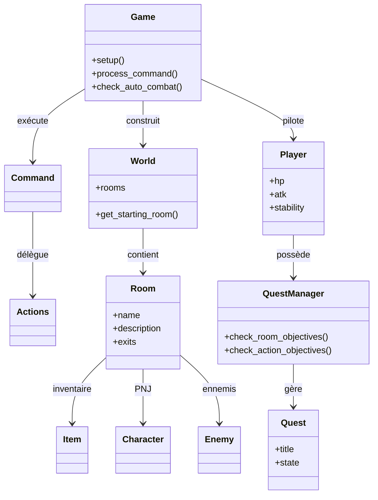

# Vigilant — Text‑Based Adventure (Jeu B)

## Guide utilisateur

### Prérequis
- Python 3.10+ (aucune dépendance externe requise)

### Installation
1) Téléchargez le projet.
2) Placez‑vous dans le dossier du jeu.

### Lancer le jeu
- **Mode console** :
  ```bash
  python game.py
  ```
- **Mode graphique (Tkinter)** :
  ```bash
  python gui.py
  ```
  Le mode graphique affiche l’image de la salle et une console intégrée.

### Univers & progression
Le jeu est découpé en **4 mondes** successifs :
1) **Eridani Prime** — survie et premier contact.
2) **Velyra IX** — oppression mécanique et choix lourds.
3) **Aurelion Prime** — illusions, vérité et pouvoir.
4) **Nova Terra** — aboutissement et choix final.

Chaque monde possède ses salles, ses PNJ, ses objets et ses quêtes dédiées.

### Conditions de victoire / défaite
- **Victoire** : le jeu se termine lorsque toutes les quêtes du monde final sont accomplies.
- **Défaite** :
  - PV à 0 en combat,
  - ou effondrement mental (stabilité trop basse),
  - ou capture dans certaines zones (ex. prison sans carte d’accès).

### Système de quêtes
- Quêtes **numérotées** et suivies dans un journal.
- États possibles : **Verrouillée**, **Disponible**, **Active**, **Terminée**.
- Certaines quêtes s’activent automatiquement, d’autres via `activate <id>`.

### Commandes principales
> Les commandes sont en français, et certaines utilisent des index issus de `look` ou `check`.

- `help` : aide générale.
- `look` : description complète de la salle + PNJ/objets numérotés.
- `go <direction>` : se déplacer (N/E/S/O/U/D). Variantes acceptées (nord, sud…).
- `back` : revenir à la salle précédente.
- `talk <num>` : parler à un PNJ (index de `look`).
- `take <num>` : ramasser un objet (index de `look`).
- `drop <num>` : déposer un objet (index de `check`).
- `use <num>` : utiliser un objet (index de `check`).
- `attack <ennemi>` : attaquer un ennemi par nom.
- `check` : inventaire du joueur (numéroté).
- `status` : état global (PV, attaque, état mental, quêtes du monde courant).
- `map` : carte ASCII du monde courant.
- `quests` : liste des quêtes et statuts.
- `quest <id>` : détail d’une quête.
- `activate <id>` : activation manuelle.
- `rewards` : récompenses obtenues.
- `history` : historique des salles visitées.
- `quit` : quitter.

### Combat
- Combat **automatique** lorsqu’un ennemi est présent.
- Résolution via un mini‑quiz (`ai_quiz.py`).
- L’attaque dépend des bonnes réponses, puis dégâts appliqués.

### Images des salles (GUI)
- Les images se trouvent dans `assets/`.
- Les noms de fichiers sont définis dans `world.py` (`ROOM_IMAGES`).
- Format recommandé : **PNG 1000×460** (ratio ~2.17:1).

---

## Guide développeur

### Architecture (modules)
- `game.py` : orchestration globale, combats, progression, conditions de fin.
- `world.py` : construction des mondes, salles, PNJ, items.
- `room.py` : modèle de salle (exits, items, PNJ, ennemis).
- `player.py` : état du joueur, inventaire, stabilité, quêtes.
- `actions.py` : commandes utilisateur (handlers).
- `command.py` : parsing et validation des commandes.
- `quest.py` : `Quest` + `QuestManager`.
- `character.py` : PNJ, dialogues réactifs, callbacks.
- `item.py` : objets et effets.
- `enemy.py` : modèle ennemi.
- `ai_quiz.py` : moteur de questions/réponses.
- `gui.py` : interface Tkinter (image + console + boutons).

### Diagramme de classes (Mermaid)



---

## Perspectives de développement

- **Sauvegarde/chargement** (sérialisation de l’état du monde).
- **Localisation** (fichiers de labels par langue).
- **Équilibrage** du quiz IA (pool de questions + difficulté progressive).
- **Amélioration UI** : animations légères, meilleure gestion responsive.
- **Nouvelles images** et cohérence visuelle par monde.
- **Journal narratif** complet (décisions, ennemis vaincus, événements clés).
